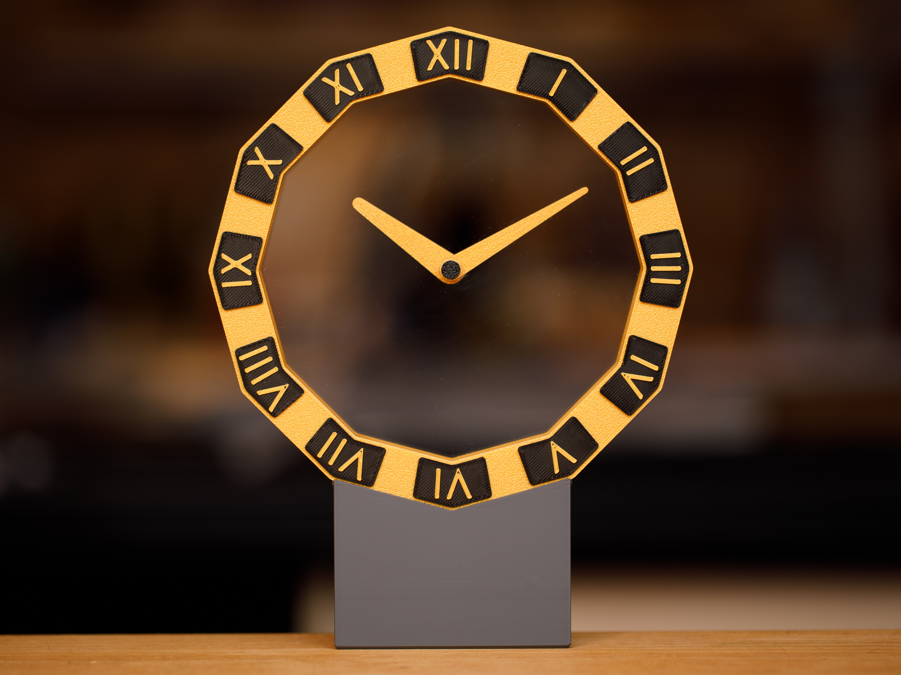

# mystery-clock

This repository contains Arduino code for a 3D-printed “Mystery Clock.”  The code is for the [Waveshare RP2040-Zero](https://www.waveshare.com/rp2040-zero.htm) microcontroller board.  See the [clock project on MakerWorld](https://makerworld.com/en/models/764838).

There are two versions of the code, depending on which motor driver board is used for the project.  mystery-clock-uln is for the ULN2003 driver board described in the MakerWorld project.  mystery-clock-tmc is for a custom driver board described below the clock photo.

## Custom Clock Driver Board
**Silent operation with greater timekeeping accuracy.**&nbsp;&nbsp;
The RP2040 and ULN2003 boards are economical solutions for driving the clock, but this combination has two limitations.  First, when driven by the ULN2003, the motor audibly hums once a minute when the hands move.  Second, the clock is not particularly accurate because it is driven by the RP2040’s internal clock.

The first problem can be solved by replacing the ULN2003 driver with the Trinamic TMC2208 driver chip.  The second problem can be solved by incorporating the extremely accurate, temperature-compensated Maxim DS3234 real-time clock chip into the circuit design.

A custom circuit board design is in development.
